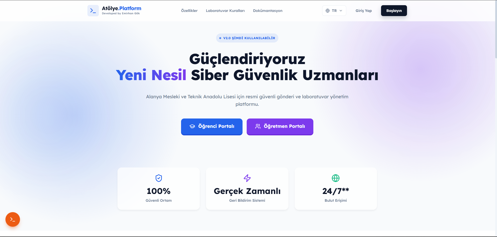

<div align="center">

<!-- HEADER BANNER -->

# 🎓 Atölye.Platform

### Eğitim kurumları için modern, güvenli ve dinamik sınav yönetim ekosistemi.

<br/>

<!-- CORE BADGES -->
[](https://github.com/Emiran404/Atolye.Platform/releases)
[](LICENSE)
[](https://github.com/Emiran404/Atolye.Platform)

<!-- TECH STACK BADGES -->
[](https://react.dev/)
[](https://vitejs.dev/)
[](https://nodejs.org/)
[](https://expressjs.com/)
[](https://www.electronjs.org/)
[](https://socket.io/)
[](https://tailwindcss.com/)
[](https://zustand-demo.pmnd.rs/)

<!-- FEATURE BADGES -->
[](https://webauthn.io/)
[](https://liderahenk.org/)
[](src/utils/i18n.js)
[](https://www.npmjs.com/package/bonjour-service)

<br/>

<!-- REPO STATS -->
     

<br/>

[Özellikler](#-temel-özellikler) • [Ekran Görüntüleri](#-ekran-görüntüleri) • [Kurulum](#-kurulum) • [Mimari](#-sistem-mimarisi) • [Yol Haritası](#-yol-haritası)

---

</div>

## 🌟 Nedir?

**Atölye.Platform**, Alanya Mesleki ve Teknik Anadolu Lisesi için geliştirilen, **Pardus** ve **Debian** tabanlı sistemlerde yerel ağ üzerinden çalışan açık kaynaklı bir sınav ve ödev yönetim ekosistemidir. Öğretmenlere uçtan uca sınav oluşturma, dağıtma, toplama ve değerlendirme; öğrencilere ise şık ve odaklanmış bir portal sunar.

> [!NOTE]
> **Atölye.Platform** bir [PolyOS](https://github.com/Emiran404) ürünüdür — *Pardus Okul Laboratuvar Yönetim ve Ödev Sistemi.*

> [!IMPORTANT]
> **Atölye.Platform**, Alanya Mesleki ve Teknik Anadolu Lisesi (Alanya MTAL) Bilişim Teknolojileri alanındaki bilgisayar laboratuvarlarında aktif olarak **Alpha aşamasında test edilmektedir** ve gerçek sınav/ödev süreçlerinde başarıyla kullanılmaktadır.

---

## ❓ Neden Atölye.Platform?

Mevcut bulut tabanlı alternatifler (Google Classroom, Moodle vb.), Milli Eğitim Bakanlığı (MEB) Fatih internet ağındaki erişim kısıtlamaları (kısıtlı portlar, engellenen domainler) ve Pardus laboratuvar ortamlarında doğrudan yerel ağ üzerinden hızlı dosya transferi gereksinimi sebebiyle yetersiz kalmaktadır. 

**Atölye.Platform** bu ihtiyaçları yerel ağ mimarisiyle çözer:
* 📡 **İnternet Bağımsızlığı**: Sunucu ve istemciler tamamen intranet (yerel ağ) üzerinde haberleşir, dış dünyaya ihtiyaç duymaz.
* ⚡ **Sıfır Konfigürasyon**: mDNS (Bonjour) protokolü sayesinde IP adresi veya DNS ayarı gerektirmeksizin cihazlar birbirini otomatik bulur.
* 🐧 **Pardus Uyumluluğu**: Yerli işletim sistemimiz Pardus ve LiderAhenk merkezi yönetim sistemi ile doğal olarak entegre çalışır.
* 📈 **Maksimum Hız**: Gigabit yerel ağ hızında, yüzlerce öğrenciye ait dosyalar saniyeler içinde toplanır ve dağıtılır.

---

## 📥 Hazır Paketler

Derleme yapmadan, aşağıdaki hazır paketlerle saniyeler içinde kurulum yapın:

<div align="center">

| | Paket | İşletim Sistemi | İndir |
| :---: | :--- | :--- | :---: |
| 🖥️ | **Öğretmen Sunucusu** | Pardus / Debian | [📥 `.deb` Sunucu](https://github.com/Emiran404/Atolye.Platform/releases/latest) |
| 🪟 | **Masaüstü İstemci** | Windows 10/11 | [📥 `.exe` Kurulum](https://github.com/Emiran404/Atolye.Platform/releases/latest) |
| 🐧 | **Masaüstü İstemci** | Linux / Pardus | [📥 `.deb` İstemci](https://github.com/Emiran404/Atolye.Platform/releases/latest) |

</div>

> [!TIP]
> **Pardus kullanıcıları:** `.deb` paketlerini çift tıklayarak veya `sudo dpkg -i paket.deb` komutuyla yükleyebilirsiniz.

---

## ✨ Temel Özellikler

<table>
<tr>
<td width="50%">

### 👨‍🏫 Öğretmen Paneli
- 📊 **Canlı Dashboard** — İstatistik kartları ve anlık aktivite akışı
- 📝 **Sınav Oluşturma** — Esnek süre, sınıf hedefleme ve çoklu format desteği
- 🔍 **Akıllı Değerlendirme** — Split-view dosya inceleme ve anlık notlandırma
- 📈 **İstatistik & Raporlama** — Sınıf bazlı başarı analizi ve PDF rapor
- 🗂️ **Dinamik Arşiv** — Geçmiş sınavları filtreleme ve toplu dışa aktarma
- 📅 **Sınav Takvimi** — Haftalık/aylık planlama görünümü
- 🏫 **Sınıf Yönetimi** — Dinamik sınıf ekleme/silme (API-driven)
- 👥 **Öğrenci Listesi** — Kayıt durumu takibi ve toplu yönetim

</td>
<td width="50%">

### 👨‍🎓 Öğrenci Paneli
- 🎯 **Odaklanmış Arayüz** — Sadece aktif sınavlara odaklanan sade tasarım
- 📤 **Sürükle-Bırak Yükleme** — Gelişmiş dosya yükleme ile hızlı teslim
- 📋 **Sınav Geçmişi** — Geçmiş notlar ve geri bildirimleri görüntüleme
- 🔔 **Anlık Bildirimler** — Socket.io ile gerçek zamanlı uyarılar
- 🔐 **Passkey Girişi** — Şifresiz, biyometrik kimlik doğrulama
- 🌍 **4 Dil Desteği** — Türkçe, İngilizce, Almanca ve Rusça

</td>
</tr>
</table>

### 🛡️ Güvenlik & Entegrasyon

| Özellik | Açıklama |
| :--- | :--- |
| **🔐 WebAuthn / Passkey** | Windows Hello ve Pardus biyometrik sistemleriyle şifresiz giriş |
| **📂 LiderAhenk / LDAP** | Kurumsal kullanıcı dizinleriyle otomatik senkronizasyon *(Beta)* |
| **📡 mDNS Auto-Discovery** | İstemciler sunucuyu ağda otomatik keşfeder — IP girmeye gerek yok |
| **🛡️ Kod Karıştırma** | Production build'de JavaScript Obfuscation ile kaynak kodu koruması |
| **🔒 JWT Authentication** | Her API çağrısında token bazlı yetkilendirme |
| **⏱️ Rate Limiting** | Brute-force ve DDoS koruması |
| **📑 Güvenli PDF/Resim** | Kimlik doğrulamalı ve korumalı dosya izleyici (v4.0.1) |
| **💾 SQLite Veritabanı** | Yerleşik `node:sqlite` veritabanı (SQLite native modülü yoksa otomatik JSON fallback desteği) |
| **🚫 Anti-Cheat / Kiosk** | Electron istemcisi üzerinde çalışan Alt+Tab tespiti, Developer Tools engellemesi, odak kaybı izleme ve sadece istemci üzerinden sınava giriş izni (v4.0.1) |

### 🚫 Kiosk & Anti-Cheat Modu (Öğrenci İstemcisi)

Sınav güvenliğini en üst düzeye çıkarmak için **Electron İstemcisi** özel bir kiosk ve koruma moduyla çalışır:
* **Klavye / Kısayol Engeli**: `Alt+Tab`, `Ctrl+Alt+Del` (Windows için) veya Pardus/Linux masaüstü geçiş kısayolları izlenir ve engellenir.
* **Ekran ve Odak Takibi**: Öğrenci sınav ekranı dışına tıkladığında veya odağı kaybettiğinde sisteme otomatik uyarı düşer.
* **Developer Tools Koruması**: Tarayıcı konsolunun açılması engellenir, kaynak koduna erişim kapatılır.
* **Zorunlu İstemci**: Sınav oluşturulurken "Sadece İstemci (Kiosk) İzni" seçilerek öğrencilerin tarayıcıdan girmesi tamamen engellenebilir.

---

## 📸 Ekran Görüntüleri

<div align="center">

### Öğretmen Paneli

| Dashboard | Sınav Oluşturma |
| :---: | :---: |
|  |  |
| *Canlı istatistikler ve sistem takibi* | *Esnek sınav hazırlama ekranı* |

| Değerlendirme | Kullanıcı Yönetimi |
| :---: | :---: |
|  |  |
| *Split-view notlandırma ve geri bildirim* | *Öğrenci ve öğretmen hesap yönetimi* |

| Güvenlik Ayarları | |
| :---: | :---: |
|  | |
| *Passkey, güvenlik ve platform ayarları* | |

| Öğrenci Dashboard | Sınav Ekranı | Soru Görüntüleyici |
| :---: | :---: | :---: |
|  |  |  |
| *Sade ve odaklanmış öğrenci portalı* | *Dosya yükleme ve sınav teslim arayüzü* | *Güvenli ve şık dosya izleme modalı* |

### Ana Sayfa


*Cinematic tasarımlı ana sayfa*

</div>

---

## 🚀 Kurulum

### Sistem Gereksinimleri

| Gereksinim | Minimum |
| :--- | :--- |
| **Node.js** | v18.0.0+ |
| **npm** | v9.0.0+ |
| **İşletim Sistemi** | Pardus 21+ / Debian 11+ / Windows 10+ |
| **RAM** | 2 GB (Sunucu) |
| **Disk** | 500 MB boş alan |

### Hızlı Başlangıç (Linux / Pardus)

```bash
# 1. Projeyi klonlayın
git clone https://github.com/Emiran404/Atolye.Platform.git
cd Atolye.Platform

# 2. Otomatik kurulum sihirbazını çalıştırın
chmod +x kurulum.sh
./kurulum.sh

# 3. Platformu başlatın
chmod +x baslat.sh
./baslat.sh
```

### 🌐 Çevrimdışı (Offline) Kurulum (MEB İnternet Kısıtlaması)

Fatih Projesi internet ağındaki port kısıtlamaları veya tamamen interneti bulunmayan bilgisayar laboratuvarları için projenin **Çevrimdışı (Offline) Paket** desteği mevcuttur:

1. GitHub Releases sayfasından güncel çevrimdışı paketi (`atolye-platform-offline_v4.0.1.zip` veya ilgili sürüm) indirin ve sunucu bilgisayarına taşıyın.
2. Arşivi proje klasörü içerisine kopyalayın (açmanıza gerek yoktur).
3. Kurulum sihirbazını çalıştırın:
   ```bash
   chmod +x kurulum.sh
   ./kurulum.sh
   ```
4. Ekrana gelen seçeneklerden **"2) Çevrimdışı (Offline)"** modunu seçin.
5. Sihirbaz yereldeki zip dosyasını tespit edip, dış ağ bağımlılıklarına ihtiyaç duymadan `node_modules` ve `dist` klasörlerini otomatik açarak sistemi tamamen hazır hale getirecektir.

### Manuel Kurulum

```bash
# 1. Projeyi klonlayın
git clone https://github.com/Emiran404/Atolye.Platform.git
cd Atolye.Platform

# 2. Bağımlılıkları yükleyin (frontend + backend)
npm run install:all

# 3. .env dosyasını yapılandırın
cp .env.example .env

# 4. Geliştirme modunda başlatın
npm run dev

# 5. Production build
npm run build
```

> **Windows kullanıcıları:** `kurulum.sh` yerine doğrudan `npm run install:all` ve `npm run dev` komutlarını kullanın.

### 🐳 Docker ile Kurulum (Önerilen Production Kurulumu)

Uygulamayı bir sunucuda 7/24 kesintisiz (production) çalıştırmak için en kolay yöntem Docker kullanmaktır.

```bash
# 1. Projenin ana (Source Code) kaynak kodlarını indirin veya klonlayın
git clone https://github.com/Emiran404/Atolye.Platform.git
cd Atolye.Platform

# 2. Docker kullanarak sistemi izole ortamda ayağa kaldırın
docker-compose up -d --build
```
> [!NOTE]
> Bu komut, gerekli `Dockerfile` yönergelerini takip ederek frontend ve backend'i derler, ve varsayılan olarak **80** ile **3001** portlarından yayına alır. Sistemin tamamen başlaması derleme sürecine bağlı olarak birkaç dakika sürebilir.

---

## 🌐 PolyOS Ekosistemi

Atölye.Platform, okul laboratuvarlarını uçtan uca dijitalleştirmeyi amaçlayan **PolyOS** şemsiye projesinin bir parçasıdır ve aşağıdaki entegre bileşenlerle tam uyumlu bir ekosistem sunar:

1. **PolyOS Labs**: Bilgisayar laboratuvarındaki istemci makinelerin açılış, kapanış, masaüstü yönetimi ve genel durum izlemesini sağlayan yönetim katmanı.
2. **OGA (Öğrenci Gönderme Aracısı)**: Öğretmen bilgisayarından öğrenci bilgisayarlarına hızlı dosya aktarımı, komut çalıştırma ve ekran izleme sağlayan hafif veri köprüsü.
3. **LiderAhenk SSO**: Pardus ekosisteminin merkezi yönetim sistemi olan LiderAhenk LDAP dizini ile entegre çalışarak okul personelinin ve öğrencilerin mevcut kurumsal şifreleriyle tek tıkla sisteme dahil olmasını (Single Sign-On) sağlar.

---

## 🏗️ Sistem Mimarisi

```
Atölye.Platform/
├── 📂 src/                    # React Frontend (Vite)
│   ├── components/            # Yeniden kullanılabilir UI bileşenleri
│   ├── pages/
│   │   ├── teacher/           # 20+ öğretmen modülü
│   │   ├── student/           # Öğrenci portalı
│   │   └── auth/              # Kimlik doğrulama sayfaları
│   ├── store/                 # Zustand state yönetimi
│   ├── services/              # API istemci katmanı
│   └── utils/                 # i18n, tarih ve yardımcı fonksiyonlar
├── 📂 server/                 # Node.js / Express Backend
│   ├── routes/                # REST API endpoint'leri
│   ├── middleware/             # Auth, rate-limit, CORS
│   ├── data/                  # SQLite Veritabanı ve JSON dosyaları
│   └── utils/                 # LDAP, dosya işlemleri
├── 📂 client-electron/        # Electron masaüstü istemcisi
├── 📂 scripts/                # .deb paketleme scriptleri
├── 📂 deploy/                 # Systemd servis yapılandırmaları
└── 📂 screenshots/            # Ekran görüntüleri
```

### Teknoloji Yığını

<div align="center">

| Katman | Teknoloji | Versiyon |
| :--- | :--- | :--- |
| **Frontend** | React + Vite + Zustand | 19.x / 5.x / 5.x |
| **Arayüz** | Tailwind CSS + Vanilla CSS | 4.x |
| **İkonlar** | Lucide React | 0.5x |
| **Backend** | Node.js + Express.js | 18+ / 4.x |
| **Gerçek Zamanlı** | Socket.io | 4.x |
| **Masaüstü** | Electron + Electron-Builder | 30.x |
| **Keşif** | Bonjour (mDNS) | 1.x |
| **Auth** | JSON Web Token + WebAuthn | — |
| **Veri** | Yerleşik SQLite (`node:sqlite`) / JSON Fallback | — |
| **Grafikler** | Recharts | 3.x |

</div>

---

## 🗺️ Yol Haritası

- [x] ~~Dinamik sınıf yönetimi (API-driven)~~
- [x] ~~Passkey / WebAuthn desteği~~
- [x] ~~4 dilli arayüz (TR/EN/DE/RU)~~
- [x] ~~mDNS otomatik sunucu keşfi~~
- [x] ~~Windows (.exe) ve Linux (.deb) paketleri~~
- [x] ~~Cinematic UI ve Glassmorphism tasarım~~
- [x] ~~Çoklu öğretmen desteği ve rol yönetimi~~
- [ ] LiderAhenk tam entegrasyon (LDAP kullanıcı senkronizasyonu)
- [ ] Otomatik sınav değerlendirme (OGA modülü)
- [ ] Docker konteyner desteği
- [ ] Progressive Web App (PWA) desteği

---

## 🧹 Bakım

Sistem sıfırlama gerektiğinde:

| Platform | Komut |
| :--- | :--- |
| **Linux / Pardus** | `./cleanup_linux.sh` |
| **Windows** | `cleanup_windows.bat` |

> Bu araçlar kilitli süreçleri otomatik sonlandırır ve sistemi fabrika ayarlarına döndürür.

---

## 🤝 Katkıda Bulunma

Katkılarınızı bekliyoruz! Detaylı bilgi için [CONTRIBUTING.md](CONTRIBUTING.md) dosyasına göz atın.

1. 🍴 Projeyi **Fork** edin
2. 🌿 Feature branch oluşturun (`git checkout -b feature/yeni-ozellik`)
3. 💾 Commit yapın (`git commit -m "feat: yeni özellik eklendi"`)
4. 🚀 Push edin (`git push origin feature/yeni-ozellik`)
5. 📬 **Pull Request** açın

---

## 📄 Lisans

Bu proje [MIT](LICENSE) lisansı altında lisanslanmıştır. Eğitim amaçlı özgürce kullanılabilir.

---

<div align="center">

### 💙 Atölye.Platform

**Alanya Mesleki ve Teknik Anadolu Lisesi**

Geliştiren: [Emirhan Gök](https://github.com/Emiran404) • PolyOS Ekosistemi

<br/>

*Coded with ❤️ for the future of education.*

<br/>

[⭐ Bu projeyi beğendiyseniz yıldız vermeyi unutmayın!](https://github.com/Emiran404/Atolye.Platform)

</div>
