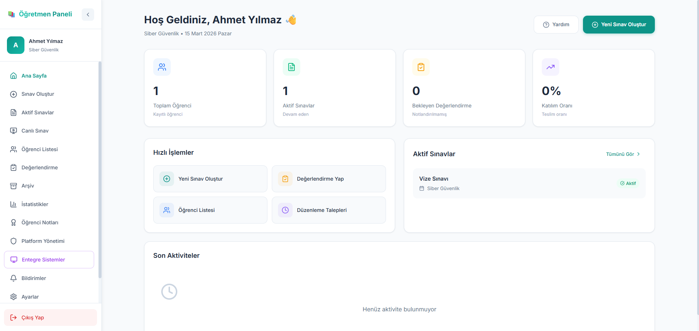
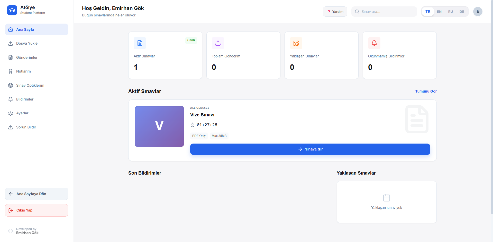
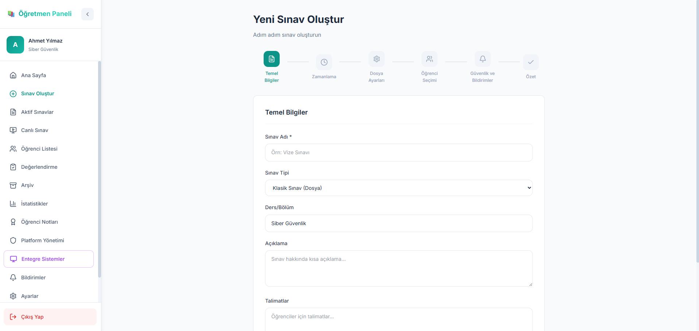
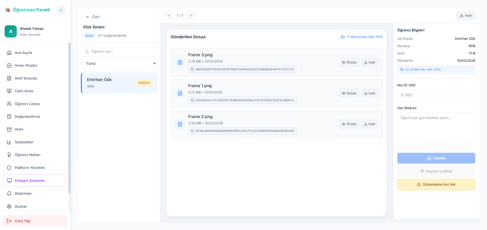
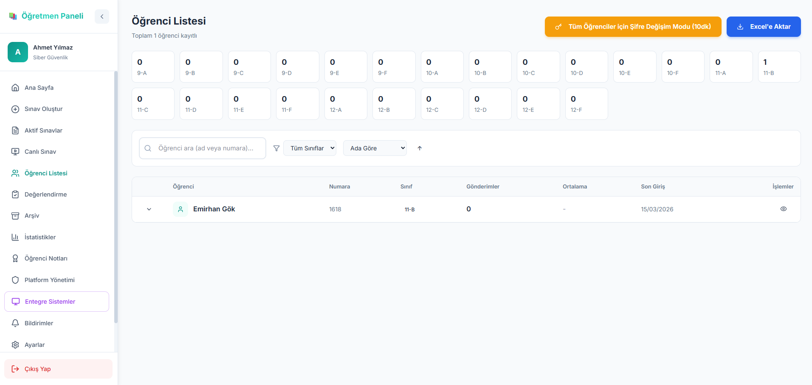
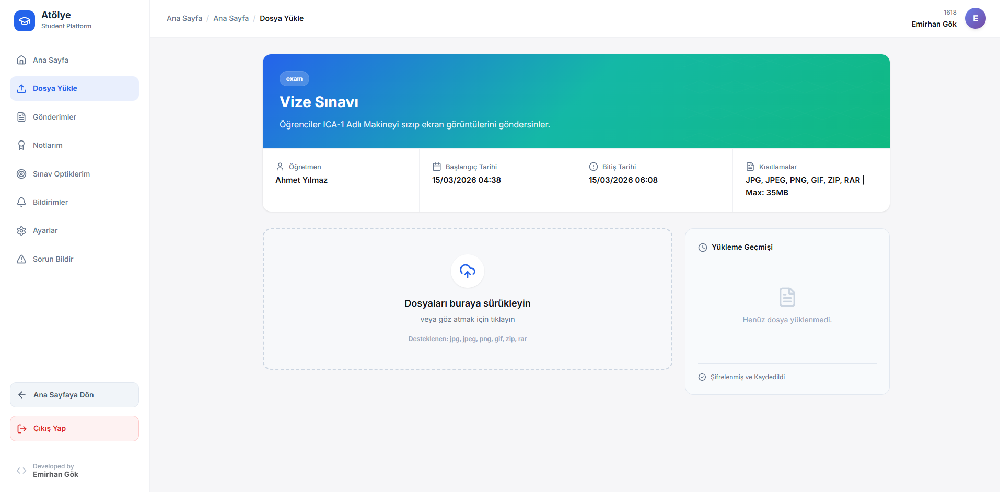
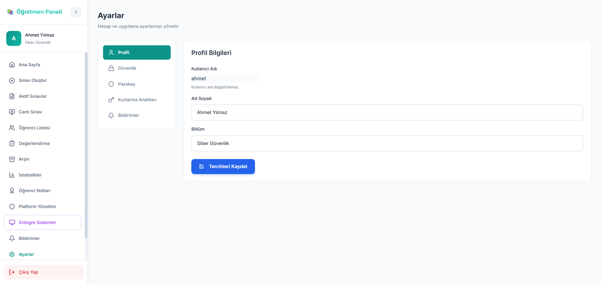

# 🎓 PolyOS Sınav Gönderme Platformu

<div align="center">


**Eğitim kurumları için modern, hızlı ve güvenli sınav yönetim ve dosya gönderim platformu.**

[Özellikler](#-özellikler) • [Ekran Görüntüleri](#-görüntü-galerisi) • [Kurulum](#-kurulum) • [Teknik Detaylar](#-teknik-detaylar)

</div>

<p align="center">
  <b>Atölye.Platform, PolyOS tarafından geliştirilen bir üründür.</b>
</p>


## ✨ Özellikler

### 👨‍🏫 Öğretmen Paneli
*   **Gelişmiş Dashboard:** İstatistik kartları ve anlık aktivite akışı ile sistemi takip edin.
*   **Sınav Yönetimi:** Kolayca yeni sınavlar oluşturun, süreleri yönetin ve ek süre tanımlayın.
*   **Akıllı Değerlendirme:** Öğrenci yüklemelerini yan yana (split-view) inceleyin ve anında notlandırın.
*   **Geri Bildirim:** Öğrencilere özel notlar ve düzeltmeler iletin.
*   **Güvenli Sıfırlama:** Çift onaylı ve bakım scriptli güvenli sistem sıfırlama mekanizması.

### 👨‍🎓 Öğrenci Paneli
*   **Odaklanmış Arayüz:** Sadece aktif sınavlara ve kendi başarısına odaklanan sade tasarım.
*   **Sürükle-Bırak:** Gelişmiş dosya yükleme sistemi ile hızlı teslim.
*   **Dil Desteği:** TR, EN, RU ve DE dillerinde tam uyumlu arayüz.
*   **Passkey Giriş:** Şifre derdi olmadan biyometrik (parmak izi/yüz tanıma) güvenli giriş.

---

## 📸 Görüntü Galerisi

<div align="center">

### 🖥️ Öğretmen Dashboard

*Modern istatistik kartları ve canlı sistem takibi*

<br/>

### 📝 Sınav Giriş Ekranı

*Öğrenciler için sade ve anlaşılır sınav katılım arayüzü*

<br/>

### ➕ Sınav Oluşturma Paneli

*Esnek süre ve soru seçenekleri ile hızlı sınav hazırlama*

<br/>

### 🎓 Notlandırma ve Değerlendirme

*Öğrenci dosyalarını inceleme ve anlık geri bildirim ekranı*

<br/>

### 👥 Kullanıcı Yönetimi

*Öğrenci ve öğretmen hesaplarını toplu yönetme arayüzü*

<br/>

### 🚩 Öğrenci Sınavı

*Öğrenciler için sade ve anlaşılır sınav arayüzü*

<br/>

### 🔐 Güvenlik ve Ayarlar

*Passkey desteği ve gelişmiş güvenlik yapılandırmaları*

</div>

---

## 🚀 Kurulum

1.  **Projeyi Klonlayın:**
    ```bash
    git clone https://github.com/Emiran404/Atoyle.Platfrom.git
    cd sinav-gonderme-platformu
    ```

2.  **Bağımlılıkları Yükleyin:**
    ```bash
    npm install
    ```

3.  **Başlatın:**
    ```bash
    npm run dev
    ```

---

## 🛠️ Teknik Detaylar

| Alan | Teknoloji |
| :--- | :--- |
| **Frontend** | React 18, Vite, Zustand |
| **Styling** | Vanilla CSS, Tailwind, Framer Motion |
| **Icons** | Lucide React |
| **Backend** | Node.js, Express.js |
| **Veri** | JSON tabanlı (Database gerektirmez) |
| **Bakım** | .bat (Windows) & .sh (Linux/Pardus) |

---

## 🧹 Bakım ve Temizlik

Sistem sıfırlama sonrası kilitli dosyalar kalırsa, kök dizindeki şu güçlü araçları kullanabilirsiniz:

*   **Windows:** `cleanup_windows.bat`
*   **Linux/Pardus:** `cleanup_linux.sh`

Bu araçlar otomatik olarak kilitli süreçleri sonlandırır ve sistemi "Fabrika Ayarlarına" döndürür.

---

## 📄 Lisans

Bu proje **MIT** lisansı altında lisanslanmıştır. Detaylar için [LICENSE](LICENSE) dosyasına bakınız.

---

<div align="center">

**Geliştiren: Emirhan Gök**  
Coded with love for educators worldwide. ❤️

[⭐ Bu projeyi beğendiyseniz yıldız vermeyi unutmayın!](https://github.com/Emiran404/Atoyle.Platfrom)

</div>
